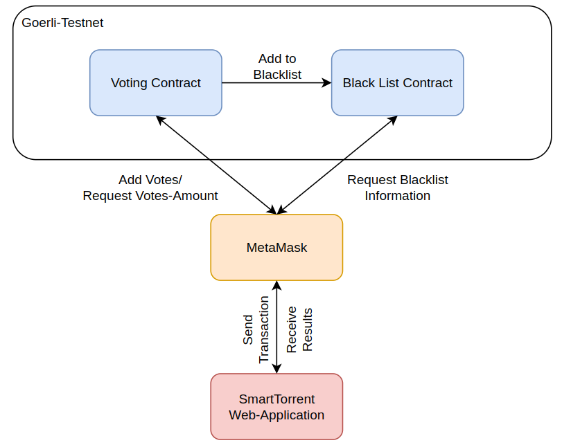
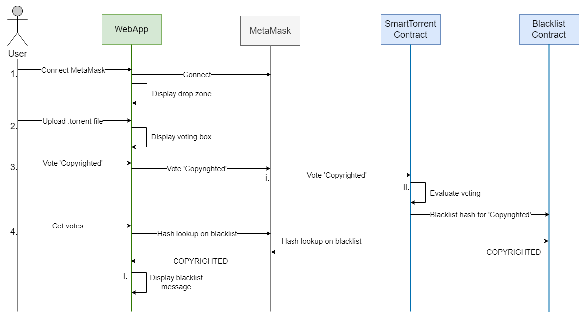
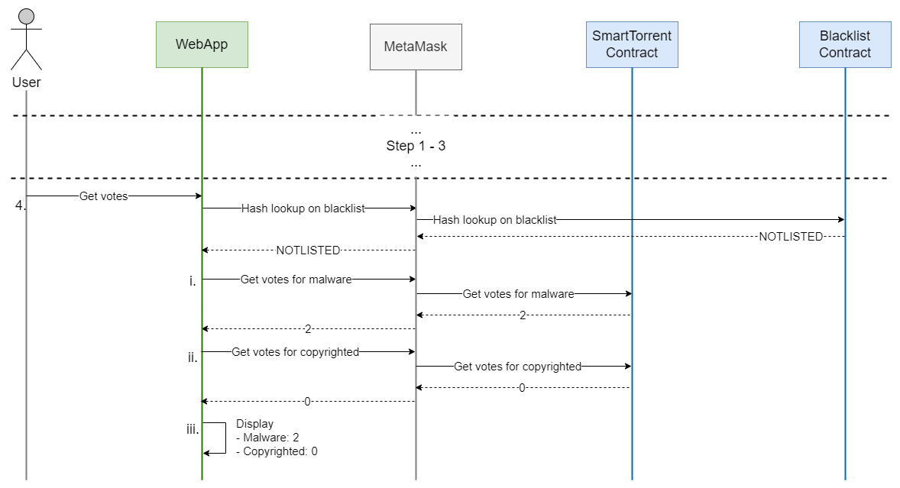

# SmartTorrent
A decentralized voting application on the Ethereum blockchain to classify torrent hashes into different categories (e.g. malware and copyrighted).

# Contribution information
- Contributors:
  - Adrian Locher
  - Jason Benz
  - Fadil Smajilbasic
- School: [OST - Eastern Switzerland University of Applied Sciences](https://www.ost.ch/)
- Module: Blockchain (BlCh)
- Semester: Autumn 2022
- Advisor: Dr. Thomas Bocek

# Overview
The goal of the project is to create an onchain voting application. Since this is a school project, it is only a software draft with limited functionality. For a productive operation, further development and extensive testing would be necessary.\
Required components ([detailed requirements](https://dsl.i.ost.ch/lect/hs22#challenge-task-hs-2022)):
- Simple frontend (triggers onchain voting and display the results)
- Contract for onchain voting
- Second contract which processes the voting result

# Technical Overview
- Contract Language: Solidity
- Ethereum Provider API: MetaMask
- Used network: Goerli Testnet
- Frontend: React
- Language: JavaScript

# System
## Technology Decisions
- The frontend framework React was chosen, because the team was already familiar with it.
- MetaMask was used to communicate with the blockchain according to the lecturers' suggestion.
- Solidity is the most commonly used contract language. Therefore, we used it.
- We used the Goerli Testnet, because it is still supported after the Ethereum transition to proof of stake.

## Libraries
The following libraries were used in the project:
- metamask/detect-provider
- parse-torrent
- react-dropzone
- react-hot-toast

## Components

## Voting Process
Possible process of voting with a blacklist entry:
1. At first, a user needs to connect to his MetaMask account. In case of success, a file drop zone is displayed on the frontend.
2. The user uploads a .torrent file and the web app extract its info hash.
3. Now the user has the possibility to vote. He votes for 'Copyrighted'.
    1. The vote is done on the chain.
    2. The voting is evaluated and because the threshold is reached, the hash gets blacklisted.
4. The user clicks 'get votes', a blacklist lookup is done and the result is returned (in this case 'COPYRIGHTED').
    1. The message _Torrent is blacklisted for 'Copyrighted'_ is displayed.

Possible process of voting without a blacklist entry:
- Step 1 - 3 will be almost the same as in the previous graphic. The only difference is that the threshold is not reached and therefore the hash does not end up on the blacklist.
4. The user clicks 'get votes', a blacklist lookup is done and the result is returned (in this case 'NOTLISTED').
    1. The number of votes for 'Malware' is fetched.
    2. The number of votes for 'Copyrighted' is fetched.
    3. The result _Votes for Malware: 2_ and _Votes for Copyrighted: 0_ is displayed.

## Local Execution on Testnet 
1. Deploy TorrentBlackList.sol to Goerli testnet (owner address needed)
2. Deploy SmartTorrent.sol to Goerli testnet (blacklist address needed)
3. Change the contract addresses in your project
4. `npm install` in `.\frontend\blch-smart-torrent\`
5. `npm start` in `.\frontend\blch-smart-torrent\`

Step 1 - 3 can be skipped if the already deployed contracts should be used.

### Contract information
The app currently interacts with the following contracts on the Goerli testnet:
- Owner: [0xf232b2993dDa9Bde0157DFCD091496Ff62C0CeBb](https://goerli.etherscan.io/address/0xf232b2993dda9bde0157dfcd091496ff62c0cebb)
- BlackList
    - Creation transaction: [0x3d9efb6d8559a0f7333eb1c43a1e9aea15d0c6e6b7e448d56e30b1b8e1d63f18](https://goerli.etherscan.io/tx/0x3d9efb6d8559a0f7333eb1c43a1e9aea15d0c6e6b7e448d56e30b1b8e1d63f18)
    - Contract address: [0x7b89c0531005c7f4b1e8a4988ca607a073ef892c](https://goerli.etherscan.io/address/0x7b89c0531005c7f4b1e8a4988ca607a073ef892c)
    - Method 'addCategoryToEntry': 0x94a15ae8
    - Method 'getEntry': 0x9a5e4eb4
- SmartTorrent
    - Creation transaction: [0x0e039cd4dd554dd75228b7843a2db8200a1027201570e4fa00d7062621ea4bc6](https://goerli.etherscan.io/tx/0x0e039cd4dd554dd75228b7843a2db8200a1027201570e4fa00d7062621ea4bc6)
    - Contract address: [0x816197b9783cbe56a366152366e22d4ef9bd9892](https://goerli.etherscan.io/address/0x816197b9783cbe56a366152366e22d4ef9bd9892)
    - Method 'vote': 0xc9a28cb9
    - Method 'getVotesAmount': 0x19c6268e